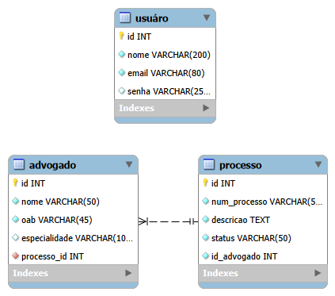

# API de Advocacia – Desenvolvimento Back-End

API RESTful desenvolvida em **Node.js + Express** para gerenciar usuários, advogados e processos jurídicos.  
A API utiliza **JWT** para autenticação e **bcrypt** para armazenar as senhas de forma segura (hash).  
Na persistência de dados é usado o ORM **Sequelize** com banco de dados **MySQL**.

Este projeto faz parte da disciplina de **Desenvolvimento Back-End** e pode ser usado como base para estudo de:
- CRUD com Node.js + Express;
- Autenticação com JWT;
- Modelagem relacional simples (1:N).

---

## Compatibilidade

- Node.js >= 18.x  
- npm >= 9.x  
- Express 4.x  
- MySQL 8.x  
- bcrypt 6.x  
- jsonwebtoken 9.x  
- mysql2 3.x  
- Sequelize 6.x  

---

## Modelagem de Dados

O banco de dados MySQL (por exemplo `advocacia_db`) possui **3 tabelas** principais:

### 1. `usuario`
Armazena quem pode acessar o sistema.

- `id` (INT, PK, AUTO_INCREMENT)  
- `nome` (VARCHAR)  
- `email` (VARCHAR, UNIQUE)  
- `senha` (VARCHAR) – **hash da senha com bcrypt**, nunca texto plano.

### 2. `advogado`
Armazena os advogados cadastrados.

- `id` (INT, PK, AUTO_INCREMENT)  
- `nome` (VARCHAR)  
- `oab` (VARCHAR, UNIQUE) – número da OAB  
- `especialidade` (VARCHAR) – ex.: “Direito Civil”, “Direito Penal”

### 3. `processo`
Armazena os processos jurídicos.

- `id` (INT, PK, AUTO_INCREMENT)  
- `numero_processo` (VARCHAR, UNIQUE)  
- `descricao` (TEXT)  
- `status` (VARCHAR) – ex.: “em andamento”, “arquivado”, “finalizado”  
- `id_advogado` (INT, FK → `advogado.id`)  

**Relacionamento:**  
Um **advogado** pode ter **vários processos** (1:N),  
mas cada **processo** pertence a **apenas um advogado**.

---

## Organização do Projeto

Estrutura principal de pastas/arquivos:

```text
/app
  /commons        # helpers e utilitários
  /controllers    # lógica de cada recurso (Usuario, Advogado, Processo)
  /middlewares    # middlewares, ex.: validação de token JWT
  /models         # models Sequelize e conexão com o banco
  /routes         # definição das rotas da API
/modelagem        # arquivos de modelagem/diagrama do banco 
app.js            # ponto de entrada da aplicação (Express)
config.js         # configurações globais (BD e JWT)
package.json      # metadados e dependências do projeto
```

## Configuração do Banco de Dados

Crie um banco de dados MySQL, por exemplo: advocacia_db
(pode ser pelo phpMyAdmin ou outro cliente).

No XAMPP, inicie o MySQL e o Apache. 

---

## Diagrama do Banco de dados 


---

## Instalação e Execução

Clonar ou baixar este repositório.

Dentro da pasta do projeto, instalar as dependências:

```text
npm install
```

Certificar-se de que o MySQL está rodando e o banco advocacia_db existe.

Iniciar a aplicação em modo desenvolvimento:

```text
npm run dev
# ou
npx nodemon
```

A API ficará disponível em (por padrão):
http://localhost:3000

---

## Autenticação e Fluxo de Uso

A API utiliza JWT (JSON Web Token) para proteger as rotas.
Fluxo básico:

Cadastro de usuário

Login para obter um token JWT

Uso das rotas protegidas enviando o token no cabeçalho Authorization.

1. Cadastro de Usuário

Endpoint: POST /usuarios
Body (JSON):

{
  "nome": "Marcela",
  "email": "marcela@teste.com",
  "senha": "123456"
}

A senha é automaticamente convertida em hash com bcrypt antes de ser salva.

O email é único.

2. Login
Endpoint: POST /usuarios/login
Body (JSON):

{
  "email": "marcela@teste.com",
  "senha": "123456"
}

---

## Rotas principais

### Usuários
- `POST /usuarios` – cadastro de usuário
- `POST /usuarios/login` – login e geração de JWT
- `GET /usuarios` – lista usuários (rota protegida)

### Advogados
- `GET /advogados` – lista todos
- `GET /advogados/:id` – busca por id
- `POST /advogados` – cria advogado (protegida)
- `PUT /advogados/:id` – atualiza advogado (protegida)
- `DELETE /advogados/:id` – remove advogado (protegida)

### Processos
- `GET /processos` – lista processos
- `GET /processos/:id` – busca por id
- `POST /processos` – cria processo (protegida)
- `PUT /processos/:id` – atualiza processo (protegida)
- `DELETE /processos/:id` – remove processo (protegida)

---

## Exemplo no Postman:

Aba Authorization

Type: Bearer Token

Token: eyJhbGciOiJIUzI1NiIsInR5cCI6IkpXVCJ9...

O middleware em app/middlewares/tokenValido.js é responsável por:

Ler o cabeçalho Authorization;

Verificar se é um Bearer Token;

Validar o JWT usando o segredo configurado em config.js;

Bloquear a requisição caso o token seja inválido ou ausente.

---

## Documentação da API (Swagger)

A documentação interativa da API está disponível em:

- `http://localhost:3000/docs`  